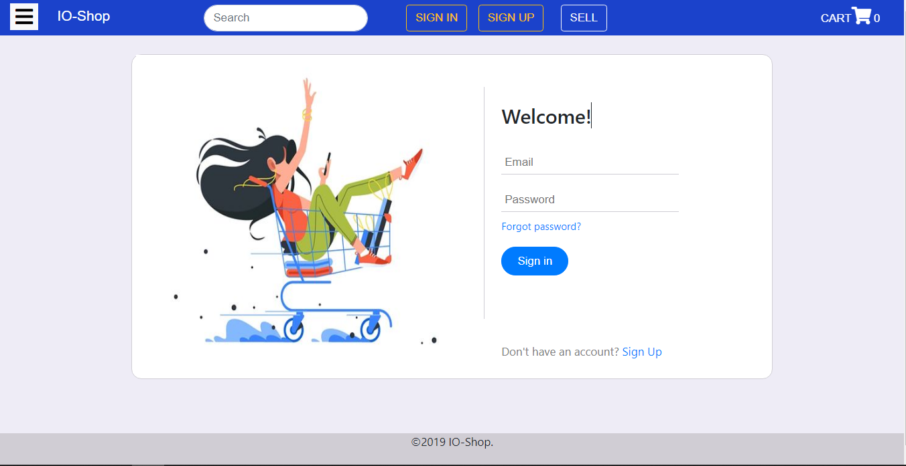
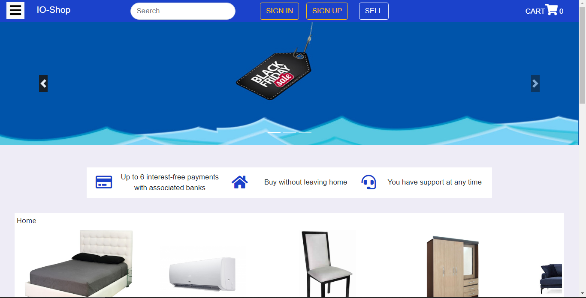
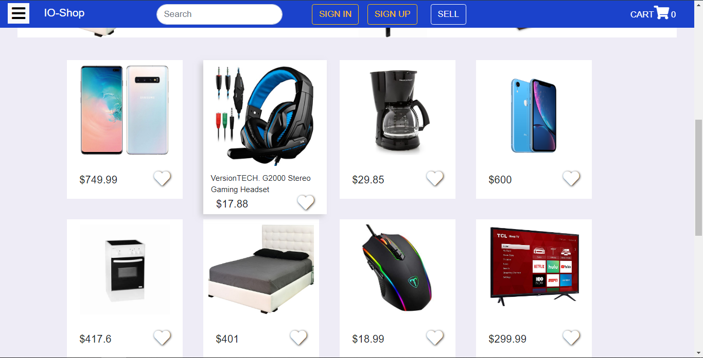

# IO Shop

E-commerce created with React.js, Node.js and MongoDB as Database.

## Configuration

In order to insert default products and users in the DB, there is a "dump" directory which contains a default database.

### Add Default Products

1. Open your console and go to this project directory

2. Then write this to create a db with default data:
   - `mongorestore -d io-shop dump/io-shop`

If everything is ok, you have a database with default data.

### Create a .env File

Go to **e-commerce-service/src** and create a **.env** file and add the next content:

``` env
MONGO_DB = mongodb://localhost/io-shop
SECRET_JWT = exampleSecret
```

### Run Service

- Open console and go to: **IO_Shop/e-commerce-service**
- Write: `npm run dev`

### Run React.js

- Open console and go to: **IO_Shop/IO-Shop-UI**
- Write `npm start`

### Login

You can login with a default user:

``` javascript
{
   'email': 'mike@gmail.com',
   'password': 'password' 
}
```

or sign up a new user.

## Features

- Cart section
- Products Search
- User Authentication System
- Uploading of images
- Add product to favorites

## Screenshots

### Form



### Home




